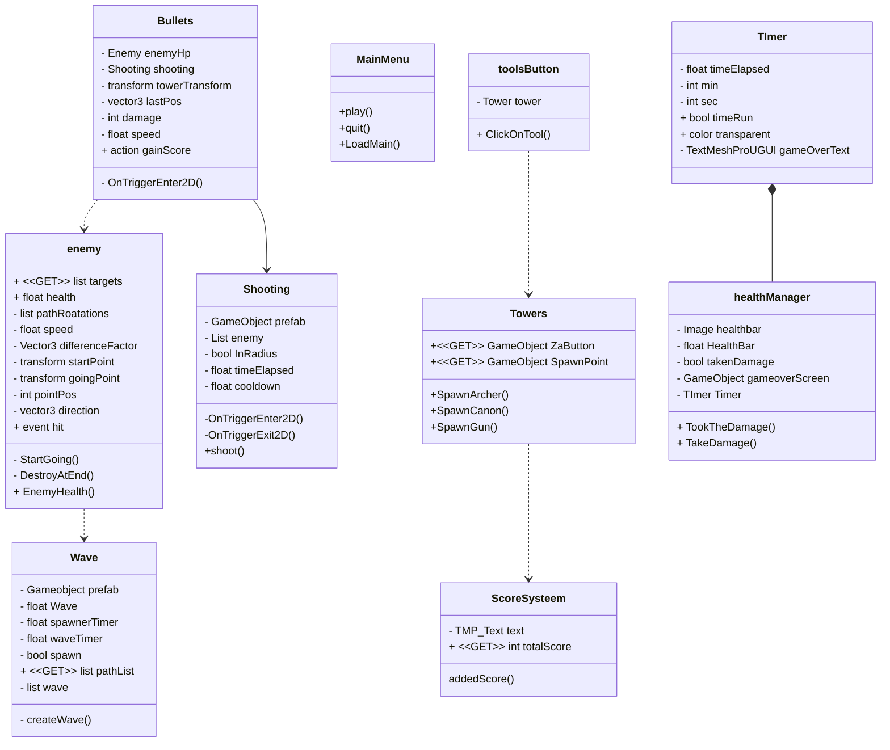

```mermaid


---
Title: Class Diagram Tower Defense
---

classDiagram


class Towers{
    +~~GET~~ GameObject ZaButton
    +~~GET~~ GameObject SpawnPoint
    +SpawnArcher()
    +SpawnCanon()
    +SpawnGun()
}

class Shooting{
    - GameObject prefab
    - List enemy
    - bool InRadius
    - float timeElapsed
    - float cooldown
    -OnTriggerEnter2D()
    -OnTriggerExit2D()
    +shoot()
}

class Bullets{
    - Enemy enemyHp
    - Shooting shooting
    - transform towerTransform
    - vector3 lastPos
    - int damage
    - float speed
    + action gainScore
    - OnTriggerEnter2D()
}

class Wave{
    - Gameobject prefab
    - float Wave
    - float spawnerTimer
    - float waveTimer
    - bool spawn
    + ~~GET~~ list pathList
    - list wave
    - createWave()
}

class enemy{
    + ~~GET~~ list targets
    + float health
    - list pathRoatations
    - float speed
    - Vector3 differenceFactor
    - transform startPoint
    - transform goingPoint
    - int pointPos
    - vector3 direction
    + event hit
    - StartGoing()
    - DestroyAtEnd()
    + EnemyHealth()
}

class healthManager{
    - Image healthbar
    - float HealthBar
    - bool takenDamage
    - GameObject gameoverScreen
    - TImer Timer
    + TookTheDamage()
    + TakeDamage()
}

class MainMenu{
    +play()
    +quit()
    +LoadMain()
}

class ScoreSysteem{
    - TMP_Text text
    + ~~GET~~ int totalScore
    addedScore()
}

class TImer{
    - float timeElapsed
    - int min
    - int sec
    + bool timeRun
    + color transparent
    - TextMeshProUGUI gameOverText
}

class toolsButton{
    - Tower tower
    + ClickOnTool()
}


Towers ..> ScoreSysteem
toolsButton ..> Towers
TImer *-- healthManager
Bullets --> Shooting
Bullets ..> enemy
enemy ..> Wave
```